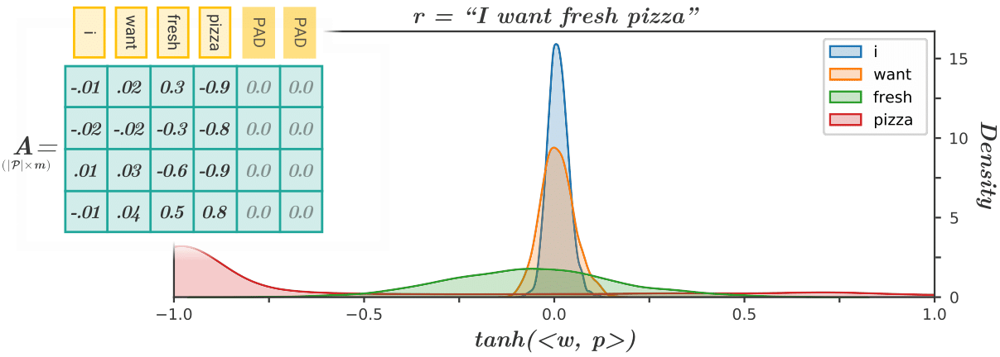

# Attention-inspired text-based recommender system with explanatory capabilities



## Overview
This repository contains the code and resources for the article *“Attention-inspired Text-based Recommender System with Explanatory Capabilities”*.  
The project introduces a recommendation system that leverages attention mechanisms to improve accuracy and generate interpretable explanations from textual data.

## Clone and environment

### 1. Clone main branch 
```bash
git clone --branch main --single-branch --depth 1 https://github.com/pablo-pnunez/TAVtext AITREX
cd AITREX
```

### 2. Create `conda` environment 
```bash
conda create --name "AITREX" python==3.9.18
conda activate "AITREX"
```

### 3. Install libraries

```bash
pip install -r requirements.txt
```

## Usage

For **inference** follow the instructions of [Inference.ipynb](1.%20Inference.ipynb)

For **training** follow the instructions of [Train.ipynb](2.%20Train.ipynb)

## Citation

If you use this repository, please cite:

```
@article{perez2025attention,
  title={Attention-inspired text-based recommender system with explanatory capabilities},
  author={P{\'e}rez-N{\'u}{\~n}ez, Pablo and Buitelaar, Paul and D{\'\i}ez, Jorge and Luaces, Oscar and Bahamonde, Antonio},
  journal={Applied Soft Computing},
  pages={113650},
  year={2025},
  publisher={Elsevier}
}
```